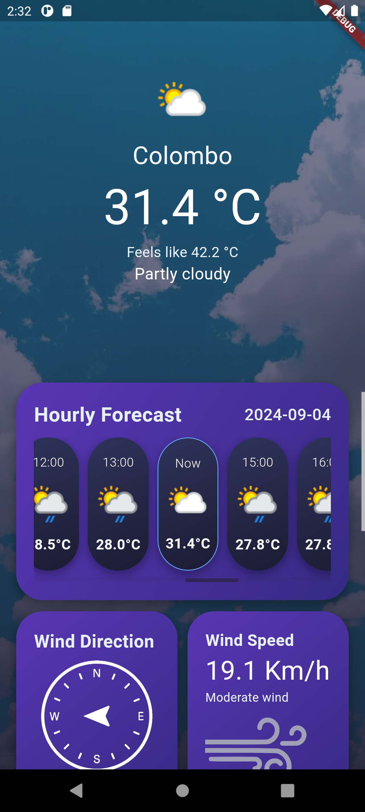
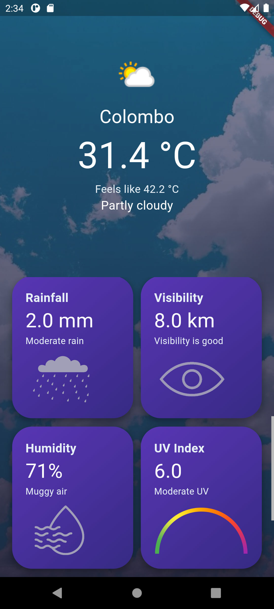
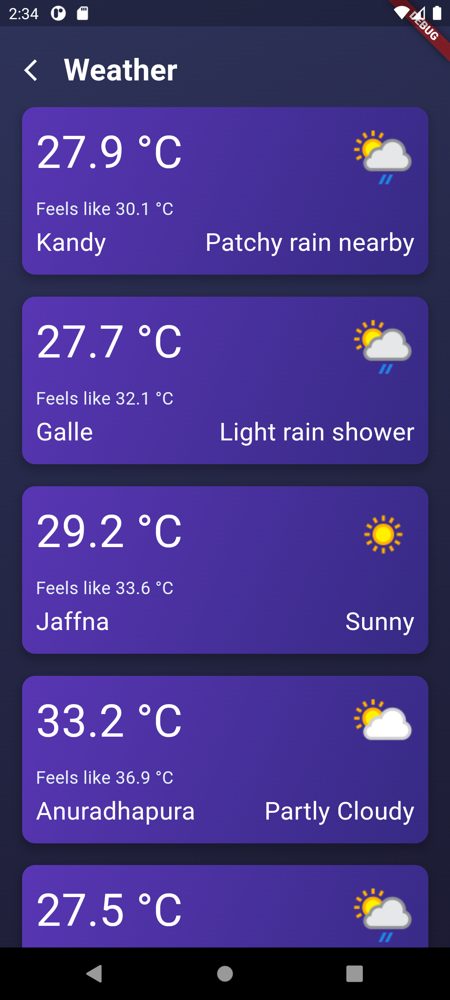

# 🌊 Weather Wave

**Weather Wave** is a Flutter-based weather app that provides real-time weather updates, powered by [WeatherAPI.com](https://www.weatherapi.com/). Stay ahead of the weather with precise data and a clean, intuitive interface.

## ✨ Features

- 🌍 **Current Location Weather**: Automatically fetches the user's current location to display weather details.
- ☀️ **Current Weather**: Shows the current weather, including temperature and "feels like" temperature.
- 🕒 **Hourly Forecast**: Provides weather forecasts on an hourly basis.
- 🌬️ **Wind Information**: Displays wind direction and wind speed.
- 🌧️ **Rainfall**: Shows expected or current rainfall.
- 👁️ **Visibility**: Displays visibility information in kilometers.
- 💧 **Humidity**: Shows the current humidity level.
- 🔆 **UV Index**: Provides the UV index along with a color-coded gauge.
- ☁️ **Cloud Coverage**: Displays the percentage of cloud coverage.
- 🌇 **Other Cities Weather**: Currently hard-coded to display weather information for 5 cities, with plans to implement dynamic city selection.

## 🚀 Getting Started

### Prerequisites

- 🛠️ [Flutter SDK](https://flutter.dev/docs/get-started/install)
- 🔑 API key from [WeatherAPI.com](https://www.weatherapi.com/)

### Installation

1. Clone this repository:
   ```bash
   git clone https://github.com/dinithmaleesha/flutter-weather-wave
2. Navigate to the project directory:
   ```bash
   cd flutter-weather-wave
3. Install the dependencies:
   ```bash
   flutter pub get
4. Add your API key from [WeatherAPI.com](https://www.weatherapi.com/) to the `lib/services/api_service.dart` file
   ```bash
   final apiKey = 'your_api_key_here';
6. Run the app:
    ```bash
   flutter run

## 🖼️ Screenshots

| Home Screen                                  | Home Screen                       | Cities Weather                            |
|----------------------------------------------|----------------------------------------------|--------------------------------------------|
|   |  |       |


## 📜 Credits
[](https://www.weatherapi.com/)
- Weather data provided by [WeatherAPI.com](https://www.weatherapi.com/) 
- Images and icons used in the app are sourced from the internet. Full credit goes to the original creators and owners. Unfortunately, the exact sources of these images are unknown. If you are the owner of any image used in this app and want it removed or properly credited, please contact us.

## 🛠️ Issues

If you encounter any issues or have suggestions for improvements, please [open an issue](https://github.com/dinithmaleesha/flutter-weather-wave/issues) on GitHub. We appreciate your feedback and contributions!

